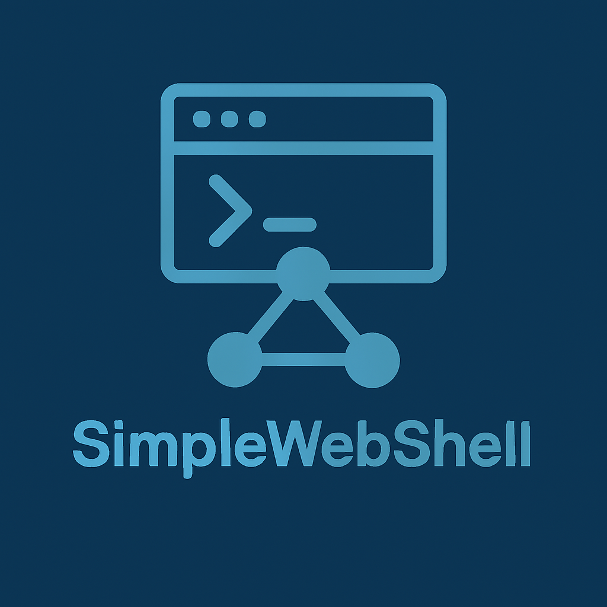

<div align="center">
  
  <h2>SimpleWebShell</h2>
  <h3>Remote Command, File and Session Management</h3>
</div>

### 1. Features
- Password-protected WebShell supporting GET/POST command execution; optional session to preserve working directory and context
- Session persists the current working directory, environment snapshot, preferred shell, command history, user/group, resource probing (CPU/memory/disk) and host metadata (OS/arch/hostname/uname etc.)
- Single-page frontend: command input, session select/create, historical session list (details/delete), file upload/download (progress bar, cancellable)
- File upload (multipart, supports specifying target path) and file download (supports cancel mid-transfer), no size limit
- API returns plain text/JSON for easy scripting

### 2. Quick Start
```bash
# Start the service (example)
./SimpleWebShell -key 123456 -port 8878 -shell /bin/bash

# Browser access
# http://<host>:8878/?key=123456
```
> The `-key` argument is required. Default shell is `/bin/bash` (cmd recommended on Windows), default port is 8878.

### 3. Startup Arguments
| Argument | Default    | Description                        |
|----------|------------|------------------------------------|
| -key     | (required) | Access password                    |
| -shell   | /bin/bash  | Shell path used to execute commands |
| -port    | 8878       | Listening port                     |
| -tls     | false      | Enable HTTPS (cert and key required) |
| -cert    | (empty)    | TLS certificate file path (PEM)     |
| -keyfile | (empty)    | TLS private key file path (PEM)     |

### 3.1 HTTPS Usage (Optional)
The service starts over HTTP by default. To enable HTTPS, provide a PEM certificate and private key:

```bash
# Generate a self-signed certificate (testing only)
openssl req -x509 -newkey rsa:2048 -nodes \
  -keyout server.key -out server.crt -days 365 -subj "/CN=your.host"

# Start with HTTPS
./SimpleWebShell -key 123456 -tls -cert ./server.crt -keyfile ./server.key -port 8878

# Browser access
# https://<host>:8878/?key=123456
```

> At startup the certificate and key files are checked for existence, PEM format and that they match; a mismatch aborts startup with an error.
> For production, use a certificate issued by a trusted CA, or terminate TLS at a reverse proxy (Nginx/Caddy etc.).

### 4. API Overview
| Endpoint | Method | Required Parameters | Description |
|----------|--------|---------------------|-------------|
| `/` | GET | key | Returns the frontend page (if key is correct) or a version string (if incorrect) |
| `/get` | GET | key, cmd, (session) | Executes a command; optional session preserves directory/context |
| `/post` | POST | key, cmd, (session) | Same as above; supports JSON/Form; session optional |
| `/get_current_path` | GET | key, (session) | Returns the current directory; session optional, defaults to the service process directory |
| `/file_send` | POST | key | multipart upload; fields: file, path (optional) |
| `/file_receive` | GET | key, path | Downloads the specified file; supports cancel |
| `/session_create` | GET | key | Creates a new session and returns the session key |
| `/session_list` | GET | key | Lists sessions (id and current directory) |
| `/session_delete` | GET | key, session | Deletes the specified session |
| `/session_get` | GET | key, session | Returns detailed session JSON |

### 5. Session Mechanism
- On creation, auto-probes: Owner/Groups, environment variable snapshot, preferred Shell, Git branch, CPU/memory/disk capacity, hostname/OS/arch/uname metadata etc.; probing failures are skipped and do not affect usage.
- The session saves the current working directory; `cd` operations are written to the session; successful commands are appended to History (capped at 200 entries).
- Command/path endpoints: passing the session parameter runs in that session's directory; otherwise the service process directory is used.

### 6. Frontend Operations
- Top session bar: by default no session is used; check "use session", click "new session" to create and auto-enable one; the list allows viewing details/deleting; details are shown in a popup with full JSON.
- Command area: enter a command, choose GET/POST (POST supports JSON/Form), press Enter or click "execute".
- Upload: pick a file, optionally fill in the full target path (defaults to current directory), shows progress, cancellable.
- Download: enter the file's full path, shows progress, cancellable.

### 7. Security Notes
- Intended only for legitimately authorized scenarios (remote operations/edge computing hot updates etc.); keep the password secure and restrict network reachability.
- Native HTTPS is supported (`-tls` with cert/key paths); enable it when exposing publicly, or terminate TLS at a reverse proxy.